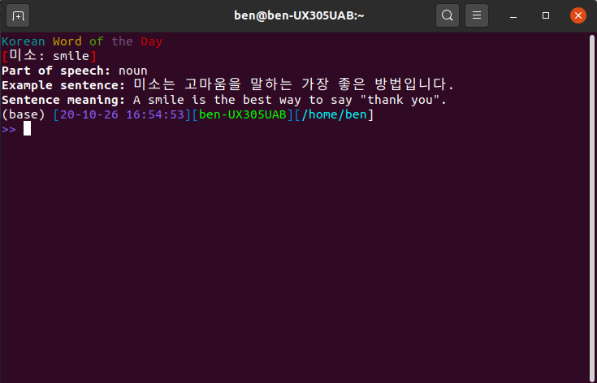

# Korean Word of the Day
Korean Word of the Day utility for Linux terminal. 

## Example alias for your 'zshrc'/'bashrc'
>     function kwotd() { path/to/script/venv/bin/python path/to/script/kwotd.py; } 
>     kwotd  # run it once.

## Requirements
Virtual Environment with: Python3, BeautifulSoup4, lxml, termcolor

## How it works
Parses the website https://www.transparent.com/word-of-the-day/ using the RSS feed for the desired language.
The results of the parsing are saved in 'tmp' folder.
It checks whether the data stored is from yesterday, if it is, it parses the website again and stores the new data.
We're doing this in-order not to spam the website everytime we open a terminal.

## Notes 

This script can be easily adapted to other languages from the website https://www.transparent.com/word-of-the-day/ using the RSS feed, just change the URL inside the script. 
Note, some other languages will require the parsing to be different since they add more information, for instance for Japanese where they add "Romaji example"
As long as the structure is the same: "Word", "Part of Speech", "Example Sentence", "Sentence Meaning" all you have to do is change the URL. 

Examples for languages with the same structure for easy URL swap:
https://www.transparent.com/word-of-the-day/today/german.html
https://www.transparent.com/word-of-the-day/today/italian.html

Remember that you need the RSS URL, it is obtainable at the top part of the website in the text:
>>Italian Word of the Day 
Visit this page each day to learn new Italian vocabulary, or get new words delivered to you every day via email or **_RSS_** feed.

## WIP:
Extracting the Audio links so it's available.
Preferably maybe embed a button in the Terminal using plugin.

Extracting the links might require Selenium because there is a delay and an iFrame when loading that part.

